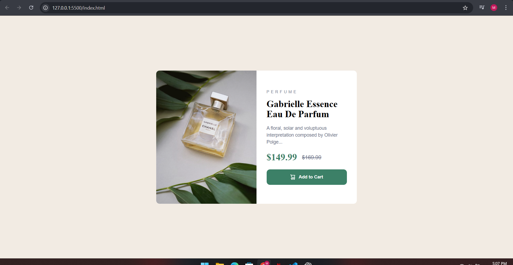

Frontend Mentor - Product Preview Card Component Solution

This is my solution to the Product Preview Card Component challenge on Frontend Mentor.
Frontend Mentor challenges help you improve your coding skills by building realistic UI components.

✅ The Challenge

Users should be able to:

View the card layout optimally depending on screen size

See hover effects on the “Add to Cart” button

📸 Screenshot

🔗 Links

Solution URL: Add your solution link here

Live Site URL: Add your live site link here

🛠 My Process
🔧 Built With

Semantic HTML5

CSS3 (Flexbox)

Mobile-first workflow

Google Fonts (Fraunces & Montserrat)

📘 What I Learned

While building this component, I learned:

How to structure a clean card layout

How to use Flexbox for responsive design

How to apply background images with no-repeat center/cover

Better typography hierarchy and spacing

Example code I'm proud of:

.card-image {
  background: url("images/image-product-desktop.jpg") no-repeat center/cover;
  width: 50%;
  min-height: 400px;
}

🚀 Continued Development

In future projects, I want to focus on:

Better CSS structure

More responsive layouts

Using CSS Grid

Advanced Frontend Mentor challenges

📚 Useful Resources

MDN CSS Background – Helped me understand background shorthand

Frontend Mentor Community – Great reference for clean solutions

👤 Author

Frontend Mentor: @mano6383

GitHub: Add your GitHub link here